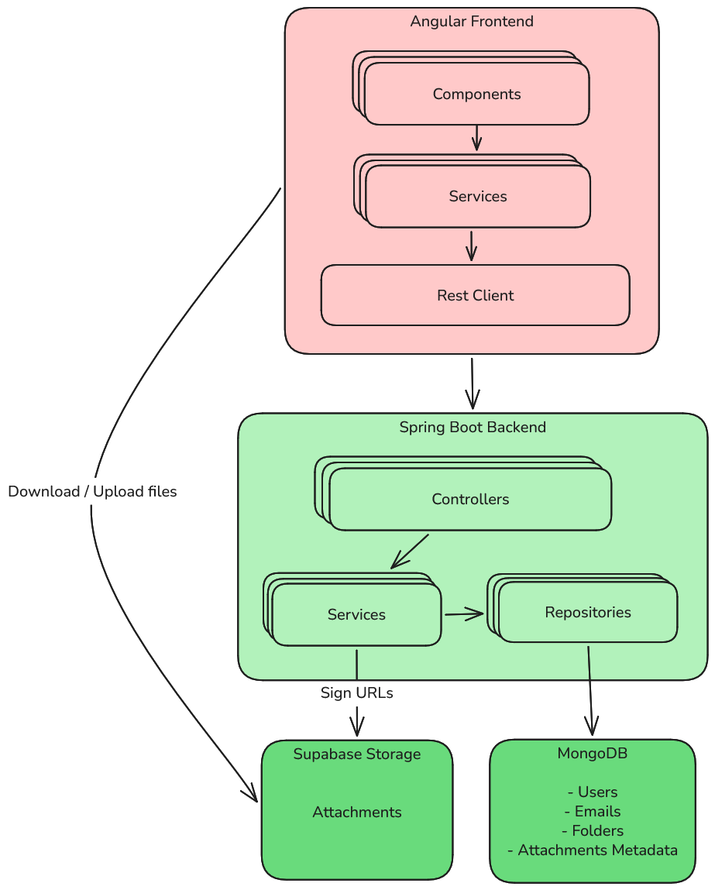
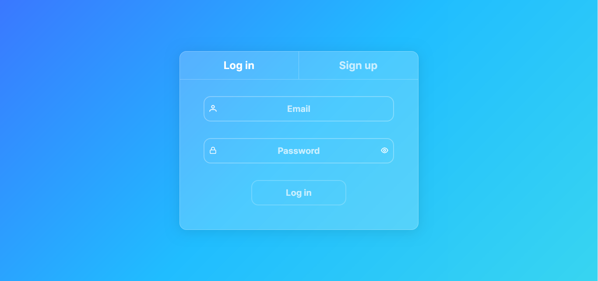
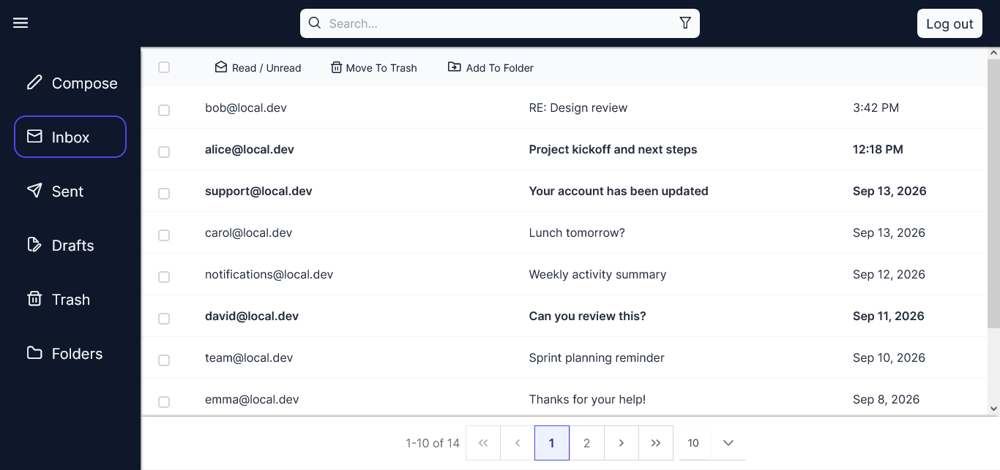
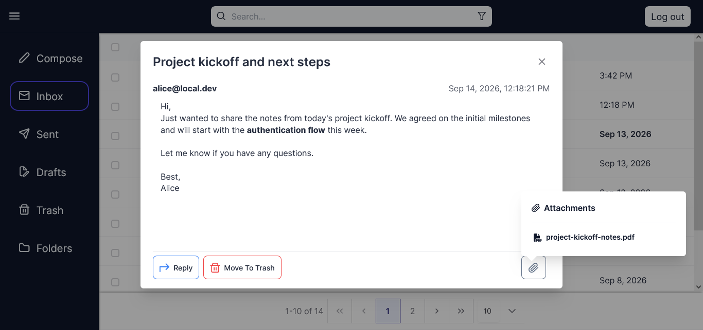
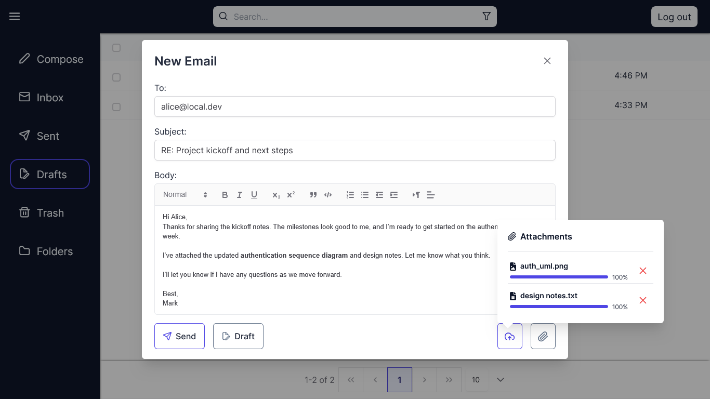
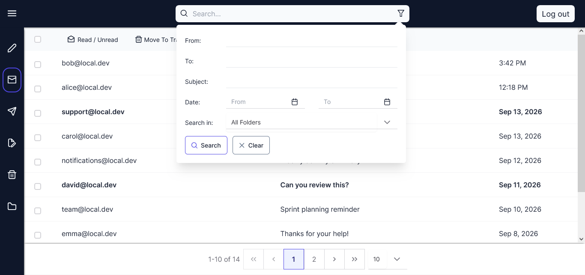
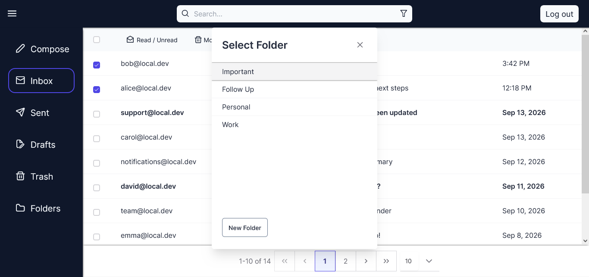
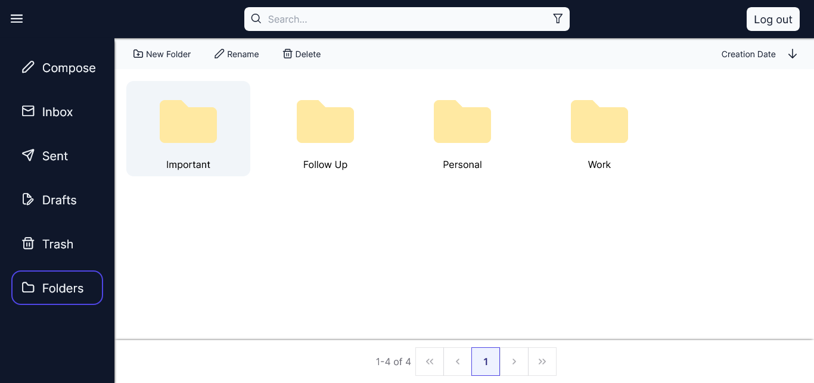

# Mailbox

Mailbox is a self-contained email management system built as a learning project. It demonstrates a full-stack web application with a Java Spring Boot backend, a MongoDB data layer, and an Angular frontend for handling email workflows in a local environment.

The project lets users sign up and log in, compose and send emails, save drafts, manage inbox/sent/trash workflows, organize custom folders, and attach files.

This project is designed to model common mail-system features without depending on a real external mail provider. It focuses on learning, architecture, and application flow rather than production-grade email delivery to third-party providers.

## Overview

Mailbox is a web-based mail client inspired by familiar email workflows. It uses a session-based backend and a MongoDB-backed data model to manage users, messages, folders, and attachment metadata.

The application is structured as two main parts:

- Backend: Java 17 + Spring Boot + MongoDB
- Frontend: Angular 15 + TypeScript + PrimeNG + Tailwind CSS

## Why this project exists

This is a learning-focused project meant to explore:

- REST API design in Spring Boot
- session-based authentication
- MongoDB data modeling for folders and emails
- Angular frontend architecture and state flow
- file storage integration with Supabase
- end-to-end app behavior in a self-contained workflow

It is not intended to replace a production mail service or send real email to external providers such as Gmail or Outlook.

## Features

- User registration and login
- Session-based authentication with CORS enabled for Angular
- Compose and send emails
- Save and manage drafts
- Inbox, Sent, Drafts, and Trash views
- Custom folder creation and organization
- Move and remove emails from folders
- Mark emails as read/unread
- Search and filter mail content
- File attachments with signed upload/download URLs

## Tech Stack


### Backend

- Java 17
- Spring Boot 3.3.1
- Spring Web
- Spring Data MongoDB
- Spring Validation
- Spring Session with MongoDB
- Lombok
- ModelMapper
- Caffeine cache

### Frontend

- Angular 15
- TypeScript
- RxJS
- PrimeNG
- Tailwind CSS
- FontAwesome

### Storage

- MongoDB
- Supabase Storage

## Prerequisites

Before running the project, make sure you have:

- Java 17 or newer
- Maven 3.9+
- Node.js 18+
- MongoDB
- A configured storage provider for signed attachment upload/download URLs

## Configuration

The backend reads these configuration values from the Spring Boot `application.properties` file. Update these values depending on whether your services are running locally or hosted in the cloud:

```properties
# Frontend Application Origin (Update if your frontend is hosted in the cloud)
app.cors.origin=http://localhost:4200
app.domain=local.dev

# MongoDB Connection (Change to your running instance host/port if not local)
spring.data.mongodb.host=localhost
spring.data.mongodb.port=27017
spring.data.mongodb.database=email

# Storage Provider Configuration
storage.endpoint=${StorageEndpoint}
storage.bucket=${StorageBucket}
storage.api.key=${StorageAPIKey}
```

### Environment Variables

For attachment support, set the following before starting the backend:

```bash
export StorageEndpoint="https://your-storage-provider.example.com"
export StorageBucket="your-bucket-name"
export StorageAPIKey="your-api-key"
```


*This project is configured to use Supabase Storage for signed attachment upload/download URLs.*

## Running the Project

### 1) Start MongoDB

Make sure your MongoDB instance is running and accessible. If you are running MongoDB locally with default settings, it will be available at:

```text
mongodb://localhost:27017
```

### 2) Run the backend

```bash
cd Backend/email
./mvnw spring-boot:run
```

By default, the backend runs on:

```text
http://localhost:8080
```

*If your backend is deployed to a cloud server, use your cloud provider's public URL/IP instead.*

### 3) Run the frontend

```bash
cd Frontend/email
npm install
npm start
```

By default, the Angular app runs on:

```text
http://localhost:4200
```

## Main Application Flow

1. User signs up or logs in.
2. Spring Boot creates a session and persists user data in MongoDB.
3. Frontend calls API endpoints for mail, folders, and attachments.
4. Emails are stored in MongoDB and folder records are updated accordingly.
5. Attachment upload/download requests are signed through the configured storage service.


## Environment Notes

The Angular frontend is configured to connect to the backend at:

```ts
export const environment = {
  apiUrl: 'http://localhost:8080',
  domain: 'local.dev'
};
```

If you deploy the backend elsewhere, update the Angular environment file in:

```text
Frontend/email/src/environments/environment.ts
```

## Screenshots

















## License

This project is licensed under the MIT License.

```text
MIT License

Copyright (c) 2026

Permission is hereby granted, free of charge, to any person obtaining a copy
of this software and associated documentation files (the "Software"), to deal
in the Software without restriction, including without limitation the rights
to use, copy, modify, merge, publish, distribute, sublicense, and/or sell
copies of the Software, and to permit persons to whom the Software is
furnished to do so, subject to the following conditions:

The above copyright notice and this permission notice shall be included in all
copies or substantial portions of the Software.

THE SOFTWARE IS PROVIDED "AS IS", WITHOUT WARRANTY OF ANY KIND, EXPRESS OR
IMPLIED, INCLUDING BUT NOT LIMITED TO THE WARRANTIES OF MERCHANTABILITY,
FITNESS FOR A PARTICULAR PURPOSE AND NONINFRINGEMENT. IN NO EVENT SHALL THE
AUTHORS OR COPYRIGHT HOLDERS BE LIABLE FOR ANY CLAIM, DAMAGES OR OTHER
LIABILITY, WHETHER IN AN ACTION OF CONTRACT, TORT OR OTHERWISE, ARISING FROM,
OUT OF OR IN CONNECTION WITH THE SOFTWARE OR THE USE OR OTHER DEALINGS IN THE
SOFTWARE.
```


## Notes

This application is self-contained. Emails are delivered between registered users within the application rather than being sent to external email providers such as Gmail or Outlook.

This project is intended as a learning-focused implementation of a mail management system. It demonstrates a complete frontend-backend workflow in a local environment.
